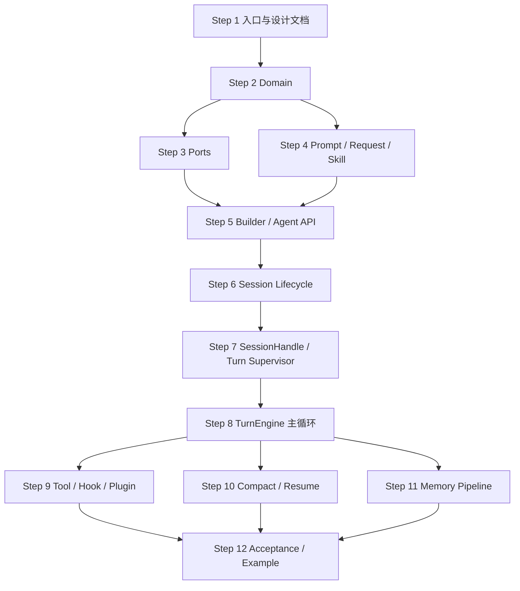

# YouYou Agent 整体代码 Review 顺序

| Field | Value |
|---|---|
| Document ID | 0011 |
| Type | review |
| Status | Final |
| Created | 2026-03-27 |
| Scope | `src/`, `tests/`, `examples/`, `Cargo.toml`, `Makefile`, `specs/` |
| Goal | 为“整体结构 review”提供一条从概念到实现、从稳定抽象到复杂编排的阅读顺序 |

## 1. 先给结论

这个仓库不适合从最大文件直接开始看。

最合理的 review 顺序是：

1. 先建立产品边界和公共 API 认知。
2. 再看 domain 和 ports，先抓住不变量与外部契约。
3. 然后看 prompt/request/builder 这类“低动态、高确定性”模块。
4. 再进入 session lifecycle 和 turn orchestration。
5. 最后再看 tool、hook、compact、memory 这些高复杂度链路。
6. 结束时用 integration tests 和 acceptance tests 做反向验证。

原因很直接：

- 代码复杂度最高的文件集中在 `src/application/session_service.rs`、`src/application/turn_engine.rs`、`src/application/tool_dispatcher.rs`。
- 这些文件本质上都在“编排”前面几层定义好的规则；如果不先理解规则，直接读编排，很容易只看到流程，看不到约束。
- 这个仓库的真实事实源不是“当前内存状态”，而是 `SessionLedger`。因此 review 时必须优先理解 ledger、metadata、恢复投影与生命周期状态机。

## 2. 仓库结构判断

从代码结构上看，这是一个 **单 crate、四层分明、单会话槽位** 的 agent kernel：

- `domain`
  - 定义消息、账本、错误、hook 契约、配置与 turn outcome
- `ports`
  - 定义模型、tool、plugin、session storage、memory storage 的外部边界
- `application`
  - 承担真正的业务编排：prompt、request、session、turn、tool、compact、memory
- `api`
  - 对外暴露 `AgentBuilder`、`Agent`、`SessionHandle`、`RunningTurn`

核心能力可以归为 8 块：

| 能力 | 主要文件 |
|---|---|
| 构建与注册 | `src/api/builder.rs`, `src/api/agent.rs` |
| 会话生命周期 | `src/application/session_service.rs`, `src/api/session.rs` |
| 单轮执行 | `src/application/turn_engine.rs`, `src/api/session.rs` |
| Prompt / Request | `src/application/prompt_builder.rs`, `src/application/request_builder.rs`, `src/prompt/templates.rs` |
| Tool / Hook / Plugin | `src/application/tool_dispatcher.rs`, `src/application/hook_registry.rs`, `src/application/plugin_manager.rs` |
| Compact / Resume | `src/application/context_manager.rs`, `src/application/turn_engine.rs`, `src/application/session_service.rs` |
| Memory Pipeline | `src/application/memory_manager.rs`, `src/application/turn_engine.rs`, `src/application/session_service.rs` |
| 端到端验证 | `tests/*.rs`, `examples/minimal_agent.rs` |

## 3. 推荐 Review 顺序

### Step 1. 先建立总览和公共边界

先看这些文件：

- `Cargo.toml`
- `src/lib.rs`
- `examples/minimal_agent.rs`
- `specs/0006_youyou_agent_design.md`
- `specs/0010_youyou_agent_review.md`

这一轮不要钻细节，目标只有三个：

- 先确认这是一个什么产品边界的库
- 先确认公开 API 长什么样
- 先确认代码作者希望你用什么抽象理解它

这一轮需要回答的问题：

- 它是不是多会话 agent？不是，它是单会话槽位
- 事实源在哪里？在 `SessionLedger`
- 对外扩展点有哪些？`ModelProvider`、`ToolHandler`、`Plugin`、`SessionStorage`、`MemoryStorage`

### Step 2. 先吃透 domain，不要急着看 orchestration

先看这些文件：

- `src/domain/types.rs`
- `src/domain/ledger.rs`
- `src/domain/config.rs`
- `src/domain/error.rs`
- `src/domain/hook.rs`
- `src/domain/event.rs`
- `src/domain/state.rs`

这是整个 review 的根。

重点不是“字段是什么”，而是“哪些不变量会被后续所有模块反复依赖”：

- `Message` / `ContentBlock` 如何建模用户、assistant、tool、system
- `SessionLedger` 为什么是事实源，以及 metadata 如何承载恢复语义
- `CompactionMarker`、`MemoryCheckpoint` 这类 metadata 为什么必须稳定
- `AgentError` 的错误边界是否清晰，是否能反推出组件职责
- `HookEvent`、`HookData`、`HookPatch` 的 patch 范围是否收敛
- `TurnOutcome` 和 `AgentEvent` 为什么分离

如果这一轮没看懂，后面 `session_service` 和 `turn_engine` 基本都会看得很痛苦。

### Step 3. 再看 ports，确认系统与外界怎么交互

先看这些文件：

- `src/ports/model.rs`
- `src/ports/tool.rs`
- `src/ports/plugin.rs`
- `src/ports/storage.rs`
- `tests/support/*.rs`

这一步的目标是先把“系统边界”钉死。

重点看：

- `ModelProvider::chat()` 输入输出的数据边界
- `ToolHandler::execute()` 的取消语义和输出格式
- `Plugin` 的初始化、apply、shutdown 合同
- `SessionStorage` / `MemoryStorage` 哪些语义由实现方负责，哪些语义由内核负责
- `tests/support` 中的 fake provider / fake storage / fake tool / fake plugin 如何映射真实契约

看到这里，你应该能明确区分：

- 哪些复杂度来自业务规则
- 哪些复杂度来自外部适配器契约

### Step 4. 看 prompt / request / skill，这一层最能说明“模型到底看到了什么”

先看这些文件：

- `src/prompt/templates.rs`
- `src/application/prompt_builder.rs`
- `src/application/request_builder.rs`
- `src/application/skill_manager.rs`
- `tests/prompt_request.rs`

这一轮非常关键，因为它决定了 review 时如何判断“行为是否符合预期”。

重点看：

- system prompt 的拼装顺序是否稳定
- `system_instructions`、`system_prompt_override`、`personality`、skills、plugins、memories、environment context 的插入顺序
- `RequestBuildOptions { allow_tools }` 如何影响 provider request
- 图片、文件、tool metadata 如何映射成模型可见消息
- skill 只允许显式触发，还是允许隐式激活

这一层看完之后，再去看 `turn_engine`，你就能分清“模型行为异常”到底是 prompt 问题、request 问题，还是 orchestration 问题。

### Step 5. 看 builder 和 agent 外壳，理解构建期冻结了什么

先看这些文件：

- `src/api/builder.rs`
- `src/api/agent.rs`
- `src/api/running_turn.rs`
- `tests/builder_contract.rs`

这一步主要看“构建期”和“运行期”之间的分界线。

重点看：

- 哪些注册表在 build 后被冻结
- model / tool / skill / plugin / storage 的重复注册和依赖校验怎么做
- 为什么 `AgentBuilder` 使用 `NoProvider` / `HasProvider` 做类型态约束
- `Agent` 为什么只暴露单会话入口
- `RunningTurn` 为什么只有事件流、取消令牌和终态 join

这一轮的输出应该是：

- 你已经知道这个仓库“能配置什么”
- 也知道它“故意不开放什么”

### Step 6. 进入 session lifecycle，先看控制面，再看 turn

先看这些文件：

- `src/application/session_service.rs`
- `src/api/session.rs`
- `tests/session_lifecycle.rs`

这一轮是第一次真正进入高复杂度实现。

推荐阅读方式：

1. 先看状态类型
2. 再看 `new_session` / `resume_session` / `close_session`
3. 最后看 restore、persist、project 相关辅助函数

重点看：

- `LifecycleState`、`SessionSlotState`、`TurnState` 的状态迁移是否闭合
- `Reserved -> Active -> Closing -> Empty` 的路径是否一致
- 为什么新建与恢复都必须先占槽位
- runtime 中哪些字段是可恢复状态，哪些只是运行时辅助
- `session_storage` 和 `memory_storage` 缺失时哪些功能退化，哪些直接报错

这一轮看完以后，再看 turn loop，心里会非常稳，因为你已经清楚“turn 在什么容器里运行”。

### Step 7. 再看 session handle 到 turn supervisor 的桥接

先看这些文件：

- `src/api/session.rs`
- `src/application/turn_engine.rs`
- `tests/turn_engine.rs`

这一轮要重点盯住“从一次 `send_message()` 到后台 turn 完结”之间的桥接。

重点看：

- `send_message()` 做了哪些同步前置校验
- skill 注入、event channel、outcome channel、cancel token 是怎么拼起来的
- `start_turn()` 如何与 `AgentControl` / `SessionRuntime` 协作
- supervisor 如何把后台 panic、正常完成、取消完成统一折叠成 `TurnOutcome`
- 为什么 `AgentEvent` 是流式过程反馈，而 `TurnOutcome` 是最终语义

这里是 review 并发和取消语义的第一现场。

### Step 8. 看 turn engine 主循环，这是最核心的业务编排

先看这些文件：

- `src/application/turn_engine.rs`

推荐按下面顺序读函数：

1. `run_turn()`
2. `run_turn_inner()`
3. `request_model_iteration_with_fallback()`
4. `consume_provider_stream()`
5. `persist_*` 与 `finalize_*`
6. `dispatch_turn_*` 与 compact / memory 相关辅助函数

这一轮重点不是“每个 helper 做了什么”，而是先抓住主状态机：

- 用户输入落盘
- prompt 构建
- request 发起
- provider stream 消费
- tool loop
- compact fallback
- memory checkpoint
- cancelled / completed / failed 三种终态收口

这是整个仓库最值得花时间的文件，因为它决定了多数组件是否真的被正确拼起来。

### Step 9. 看 tool / hook / plugin 链路

先看这些文件：

- `src/application/plugin_manager.rs`
- `src/application/hook_registry.rs`
- `src/application/tool_dispatcher.rs`
- `src/domain/hook.rs`
- `src/ports/plugin.rs`
- `src/ports/tool.rs`
- `tests/tool_hooks.rs`

这里建议按照“先 hook，后 tool，最后回到 turn engine 调用点”的方式 review。

重点看：

- plugin descriptor、声明 hook、实际注册 hook 是否一致
- `HookRegistry::dispatch()` 的顺序语义是否稳定
- patch 是“增量合并”还是“覆盖替换”
- `BeforeToolUse` 和 `AfterToolUse` 分别能改什么、能中止什么
- mutating tool 与只读 tool 为什么是两种批处理策略
- timeout、synthetic error、tool output budget 的实现是否会破坏恢复链路

这一块是“扩展性”和“可控性”的核心，需要特别看 contract 是否被 orchestration 正确尊重。

### Step 10. 看 compact / resume，这块最容易出现语义错位

先看这些文件：

- `src/application/context_manager.rs`
- `src/application/turn_engine.rs`
- `src/application/session_service.rs`
- `tests/compact_resume.rs`

这一步的关键不是压缩算法本身，而是“压缩后恢复出来的可见上下文是否和在线投影一致”。

重点看：

- `ContextManager` 如何从 ledger 重建 visible messages
- compaction marker 为什么持久化“已渲染摘要”而不是“原始摘要”
- summary compact 失败时为什么会退化到 truncation
- current turn anchor 如何被保留
- `context_length_exceeded` fallback 只应该重试一次
- 恢复链路是否会重复写 ledger、重复插入 cancel notice、重复渲染 compact summary

如果你要找“最隐蔽的状态一致性风险”，这一块优先级很高。

### Step 11. 最后看 memory pipeline

先看这些文件：

- `src/application/memory_manager.rs`
- `src/application/turn_engine.rs`
- `src/application/session_service.rs`
- `tests/memory_pipeline.rs`

memory 不适合太早看，因为它建立在 session、ledger、compact、prompt 都已经理解的前提之上。

重点看：

- bootstrap memory 与 turn-time search memory 如何合并
- memory search 为什么只使用显式文本块
- checkpoint 为什么按 ledger seq 而不是 message index
- extraction model 的输出谁负责判断，谁负责执行
- update / delete 命中缺失 target 时如何退化
- close / resume 路径如何保持 namespace pinning 与 checkpoint 一致性

这一轮结束后，仓库的主功能面就基本全看完了。

### Step 12. 用 acceptance tests 做最终反证

最后看这些文件：

- `tests/acceptance.rs`
- `examples/minimal_agent.rs`

这一步不是为了再学新知识，而是为了验证前面建立的理解是否真的闭环。

建议重点看：

- session start / end abort 是否泄漏槽位
- cancellation boundary 是否覆盖 stream 与 tool execution
- compact / resume 是否端到端一致
- memory、tool、hook、storage error 是否都能落回明确 outcome

如果前 11 步已经看完，这一步会变成“验证认知”，而不是“重新猜系统行为”。

## 4. 推荐阅读图

## 5. 为什么这个顺序最合适

### 5.1 先稳定抽象，后复杂编排

这个仓库的复杂度不是平均分布的。

高复杂度文件主要集中在：

| 文件 | 大致角色 |
|---|---|
| `src/application/turn_engine.rs` | 单轮状态机总编排 |
| `src/application/session_service.rs` | 会话生命周期与恢复控制面 |
| `src/application/tool_dispatcher.rs` | tool 批处理、timeout、并行/串行、synthetic error |
| `src/application/context_manager.rs` | ledger 到 visible context 的投影与 compact |
| `src/application/memory_manager.rs` | 搜索、提取、checkpoint 与写回 |
| `src/api/session.rs` | API 句柄与后台 supervisor 桥接 |

如果一开始直接读这些文件，会遇到两个问题：

- 只能顺着流程看，难以判断流程是否正确
- 很容易把实现细节误当作设计约束

### 5.2 这个仓库更像“状态机集合”，不是普通 CRUD 项目

review 时最该先建立的是下面这些状态语义：

- Agent 生命周期状态
- 单会话槽位状态
- 单轮 turn 状态
- ledger 与 visible context 的对应关系
- compact marker 与 memory checkpoint 的边界
- event stream 与 outcome 的分离

这些状态语义都不是从大文件里自然跳出来的，而是先由 domain、ports、API 壳子定义，再在 application 层被编排。

### 5.3 测试组织本身已经暗示了正确的 review 路径

测试文件几乎按能力分区：

| 测试文件 | 对应能力 |
|---|---|
| `tests/builder_contract.rs` | 构建与注册 |
| `tests/prompt_request.rs` | prompt / request / capability |
| `tests/session_lifecycle.rs` | session lifecycle / resume |
| `tests/turn_engine.rs` | turn event / cancel / busy |
| `tests/tool_hooks.rs` | tool batch / hook / timeout |
| `tests/compact_resume.rs` | compact / resume projection |
| `tests/memory_pipeline.rs` | memory bootstrap / search / extraction / checkpoint |
| `tests/acceptance.rs` | 端到端跨模块行为 |

所以最自然的 review 方式，就是让“读源码的顺序”尽量和“测试能力划分的顺序”一致。

## 6. 实战建议

如果你准备做一次正式整体 review，我建议按下面的产出节奏推进：

1. 第一次阅读只记“模块职责”和“状态边界”。
2. 第二次阅读只盯“持久化与恢复是否对称”。
3. 第三次阅读再盯“取消、hook、tool timeout、compact fallback”这些容易错位的细节。
4. 最后拿 acceptance tests 对照自己的理解，确认有没有遗漏的跨模块耦合。

如果时间有限，最低优先级不要先砍 domain 和 session lifecycle，而应砍 example 和部分 prompt 细节；因为真正决定这个仓库质量上限的，是 ledger、lifecycle、turn、tool、compact、memory 这几条链路。

## 7. 最终建议顺序

如果只保留一版极简顺序，我建议你按下面这 12 步执行：

1. `Cargo.toml` + `src/lib.rs` + `examples/minimal_agent.rs`
2. `src/domain/*`
3. `src/ports/*` + `tests/support/*`
4. `src/prompt/templates.rs` + `src/application/prompt_builder.rs` + `src/application/request_builder.rs` + `src/application/skill_manager.rs`
5. `src/api/builder.rs` + `src/api/agent.rs` + `src/api/running_turn.rs`
6. `src/application/session_service.rs`
7. `src/api/session.rs`
8. `src/application/turn_engine.rs`
9. `src/application/plugin_manager.rs` + `src/application/hook_registry.rs` + `src/application/tool_dispatcher.rs`
10. `src/application/context_manager.rs`
11. `src/application/memory_manager.rs`
12. `tests/*.rs`，顺序按 `builder_contract -> prompt_request -> session_lifecycle -> turn_engine -> tool_hooks -> compact_resume -> memory_pipeline -> acceptance`

这就是最贴合当前仓库结构、功能和复杂度分布的一条整体 review 路线。
